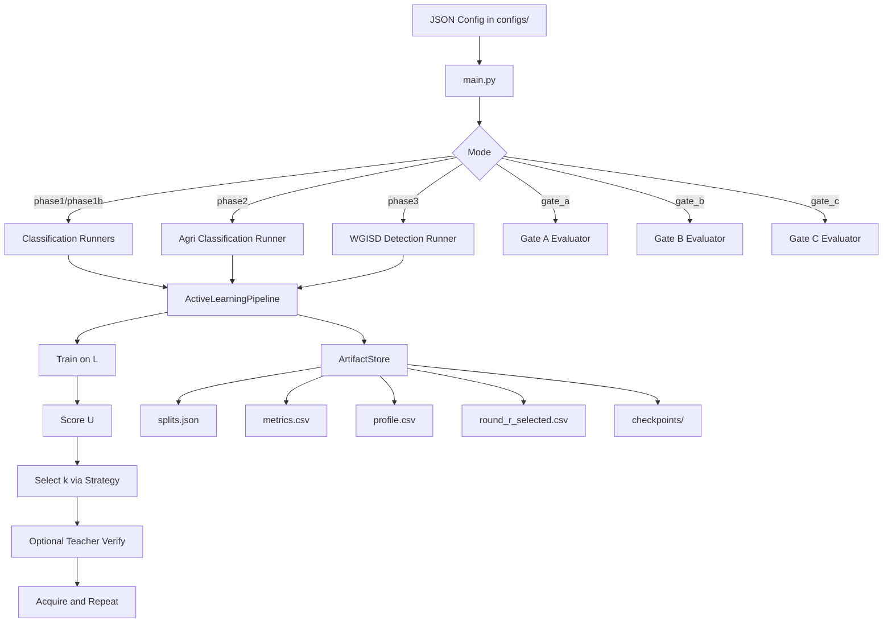

# Phase 1-3 Reviewer Guide

## 1. Purpose and Audience

This document is for journal reviewers who are unfamiliar with the repository. It explains how Phase 1 (algorithmic validation), Phase 2 (controlled agricultural transfer), and Phase 3 (field-proxy detection validation) are implemented, executed, and interpreted.

The implementation follows `docs/IMPLEMENTATION_SPEC.md` and includes gate evaluators for:
- Gate A: uncertainty vs random on Fashion-MNIST.
- Gate B: agri-pretrained backbone transfer vs ImageNet initialization.
- Gate C: uncertainty vs random on WGISD proxy with uncertainty-type and quantization analysis.

## 2. Where to Start in the Codebase

Core entrypoint:
- `src/main.py`

Phase runners:
- `src/edge_al_pipeline/experiments/phase1_fashion_mnist.py`
- `src/edge_al_pipeline/experiments/phase1b_cifar10.py`
- `src/edge_al_pipeline/experiments/phase2_agri_classification.py`
- `src/edge_al_pipeline/experiments/phase3_wgisd_detection.py`
- `src/edge_al_pipeline/experiments/phase3_uncertainty_comparison.py`
- `src/edge_al_pipeline/experiments/phase3_wgisd_setup.py`

Model runners:
- `src/edge_al_pipeline/models/fashion_mnist_runner.py`
- `src/edge_al_pipeline/models/cifar10_runner.py`
- `src/edge_al_pipeline/models/image_folder_mobilenet_runner.py`
- `src/edge_al_pipeline/models/wgisd_detection_runner.py`

AL orchestration and artifacts:
- `src/edge_al_pipeline/pipeline.py`
- `src/edge_al_pipeline/artifacts.py`
- `src/edge_al_pipeline/config.py`

Gate evaluators:
- `src/edge_al_pipeline/evaluation/gate_a.py`
- `src/edge_al_pipeline/evaluation/gate_b.py`
- `src/edge_al_pipeline/evaluation/gate_c.py`

## 2.1 Architecture Diagram (Phase 1-3 + Gates)



## Setup Notes (for Reproducibility)

Recommended environment:
- Python 3.13+
- Virtual environment in `.venv`

Minimal setup:
```powershell
python -m venv .venv
.\.venv\Scripts\python -m ensurepip --upgrade
.\.venv\Scripts\python -m pip install -e .[dev,phase1,phase2,phase3]
```

## 3. Common Experimental Lifecycle

Each seed executes the same loop:
1. Initialize reproducible splits `L/U/V/T`.
2. Train model on current `L`.
3. Score unlabeled pool `U` for informativeness.
4. Select `k` candidates (`random`, `entropy`, or `k_center_greedy`).
5. Optionally apply teacher reranking (Phase 3).
6. Move selected IDs from `U` to `L` and continue for configured rounds.

Primary run artifacts:
- `config_snapshot.json`
- `splits.json`
- `metrics.csv`
- `profile.csv`
- `round_{r}_selected.csv`
- `checkpoints/`

Run directory pattern:
- `runs/<experiment_name>/<UTC timestamp>_seed<seed>/`

## 4. Configuration Contract

Experiments are JSON-config driven:
- `dataset`: name, root, version, task, optional class count
- `model_name` and `model_params`
- `strategy_name` and optional `strategy_params`
- `rounds`, `query_size`, `seeds`
- `quantization_mode`, `teacher_enabled`, `edge_device`
- `bootstrap`: `pool_size`, `initial_labeled_size`, `val_size`, `test_size`

Validation is enforced in `src/edge_al_pipeline/config.py`.

## 5. Phase 1 and 1b (Fashion-MNIST, CIFAR-10)

Commands:
```powershell
.\.venv\Scripts\python src/main.py --mode phase1 --config configs/phase1_fashion_mnist.json
.\.venv\Scripts\python src/main.py --mode phase1b --config configs/phase1b_cifar10.json
```

Gate A command:
```powershell
.\.venv\Scripts\python src/main.py --mode gate_a --config configs/phase1_fashion_mnist.json --budget-ratio 0.10 --min-improvement 0.05
```

Gate A outputs:
- `runs/gate_a_reports/gate_a_*.json`
- `runs/gate_a_reports/gate_a_*.md`

## 6. Phase 2 (Controlled Agriculture)

Dataset expectation:
- ImageFolder-style directory per class (used by PlantVillage/Fruits-360 configs).

Commands:
```powershell
.\.venv\Scripts\python src/main.py --mode phase2 --config configs/phase2_plantvillage.json
.\.venv\Scripts\python src/main.py --mode phase2 --config configs/phase2_fruits360.json
```

Gate B command:
```powershell
.\.venv\Scripts\python src/main.py --mode gate_b --pretrain-config configs/phase2_plantvillage.json --config configs/gate_b_transfer_fruits360.json
```

Phase 2 backbone export:
- `checkpoints/agri_backbone_seed<seed>.pt`

Gate B outputs:
- `runs/gate_b_reports/gate_b_*.csv`
- `runs/gate_b_reports/gate_b_*.json`
- `runs/gate_b_reports/gate_b_*.md`

## 7. Phase 3 (WGISD Field Proxy)

Phase 3 setup and execution:
```powershell
.\.venv\Scripts\python src/main.py --mode phase3_setup --config configs/phase3_wgisd_setup.json
.\.venv\Scripts\python src/main.py --mode phase3 --config configs/phase3_wgisd_detection.json
.\.venv\Scripts\python src/main.py --mode phase3_compare --config configs/phase3_wgisd_compare.json
```

Gate C command:
```powershell
.\.venv\Scripts\python src/main.py --mode gate_c --config configs/phase3_wgisd_detection.json --gate-c-min-improvement 0.0
```

Phase 3 outputs (per seed):
- `phase3_manifest.json`
- `uncertainty_summary.csv`
- standard AL artifacts (`metrics.csv`, `profile.csv`, `round_{r}_selected.csv`)

Gate C outputs:
- `runs/gate_c_reports/gate_c_*.csv`
- `runs/gate_c_reports/gate_c_*.json`
- `runs/gate_c_reports/gate_c_*.md`

## 8. Reviewer Reproducibility Checklist

1. Confirm config from `config_snapshot.json`.
2. Confirm data identity using `dataset_hash` in `splits.json`.
3. Verify all configured seeds produced run directories.
4. Inspect `metrics.csv` against labeled budget schedule.
5. Audit `round_{r}_selected.csv` for strategy behavior.
6. For Gate A, verify paired random-vs-entropy improvement at budget.
7. For Gate B, verify agri backbone export and transfer deltas.
8. For Gate C, verify uncertainty-vs-random deltas and FP32-vs-INT8 summary fields.

## 9. Current Scope Boundaries (Post-Phase 3 Baseline)

Implemented:
- Classification AL (Phase 1, 1b, 2)
- Detection AL on WGISD proxy (Phase 3)
- Multi-seed run scaffolding and artifact contracts
- Gate A, Gate B, and Gate C evaluators
- Teacher reranking integration for Phase 3 runs
- Quantization mode comparison support in Gate C workflow

Not implemented yet (planned for Phase 4+):
- Hard noisy in-field dataset return workflow (for example PlantDoc) with label QA protocol
- Non-heuristic teacher model with explicit bandwidth-reduction KPI reporting
- Deployment-grade export and on-device profiling package (TorchScript/TFLite plus thermal and power instrumentation)

## 10. Suggested Citation-Ready Reporting Structure

For manuscript reproducibility, report:
- Full JSON config(s) in supplement
- Seed list and number of seeds
- Labeled budget schedule (`initial_labeled_size`, `query_size`, rounds)
- Gate-level pass criteria and measured deltas
- Hardware and quantization context from `profile.csv` and gate reports
- Checkpoint provenance (run directory and checkpoint filename)
