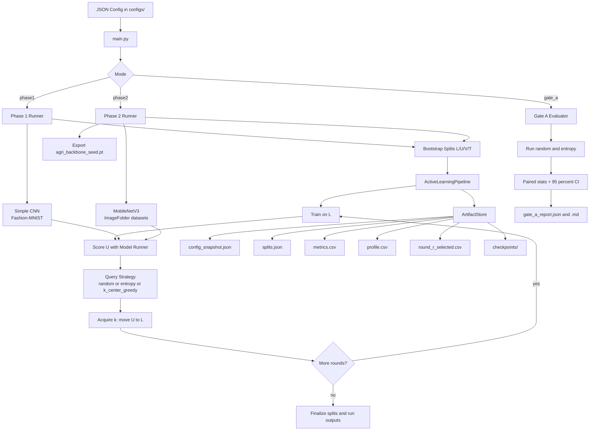

# Phase 1 and Phase 2 Reviewer Guide

## 1. Purpose and Audience

This document is written for journal reviewers who are unfamiliar with the repository. It explains how Phase 1 (algorithmic validation) and Phase 2 (controlled agricultural transfer) are implemented, how experiments are executed, and how results should be interpreted.

The implementation follows the curriculum in `docs/IMPLEMENTATION_SPEC.md`:
- Phase 1: validate Active Learning (AL) logic on Fashion-MNIST.
- Phase 2: transfer the validated loop to controlled agricultural classification and export an agriculture-adapted backbone.

## 2. Where to Start in the Codebase

Core entrypoint:
- `src/main.py`

Phase-specific runners:
- `src/edge_al_pipeline/experiments/phase1_fashion_mnist.py`
- `src/edge_al_pipeline/experiments/phase2_agri_classification.py`

Model runners:
- `src/edge_al_pipeline/models/fashion_mnist_runner.py`
- `src/edge_al_pipeline/models/image_folder_mobilenet_runner.py`

AL orchestration and artifacts:
- `src/edge_al_pipeline/pipeline.py`
- `src/edge_al_pipeline/artifacts.py`
- `src/edge_al_pipeline/config.py`

Gate A evaluator:
- `src/edge_al_pipeline/evaluation/gate_a.py`

## 2.1 Architecture Diagram (Phase 1 and Phase 2)



## Setup Notes (for Reproducibility)

Recommended environment:
- Python 3.13+
- Virtual environment in `.venv`
- Required packages for Phases 1-2: `torch`, `torchvision`

Minimal setup commands:
```powershell
python -m venv .venv
.\.venv\Scripts\python -m ensurepip --upgrade
.\.venv\Scripts\python -m pip install -e .[dev,phase2]
```

## 3. Common Experimental Lifecycle (Both Phases)

Each seed executes the same loop:
1. Initialize splits `L/U/V/T` from a reproducible random seed.
2. Train model on current `L`.
3. Score unlabeled pool `U` for informativeness (entropy by default).
4. Select `k` samples using the configured strategy.
5. Move selected IDs from `U` to `L`.
6. Repeat for configured rounds.

Artifacts are written per run directory:
- `config_snapshot.json` (full config used at runtime)
- `splits.json` (current `L/U/V/T` and counts)
- `metrics.csv` (`loss`, `train_accuracy`, `val_accuracy`, `test_accuracy`)
- `profile.csv` (stage latency metadata)
- `round_{r}_selected.csv` (sample IDs, score, strategy metadata)
- `checkpoints/` (phase-specific model exports)

Run directory naming convention:
- `runs/<experiment_name>/<UTC timestamp>_seed<seed>/`

Sample IDs:
- IDs are synthetic keys like `sample_000123`; they map to dataset indices used by each runner.

## 4. Configuration Contract

Experiments are JSON-config driven (see `configs/`):
- `dataset`: dataset name/path/version/task/optional class count
- `model_name` + `model_params`
- `strategy_name`: `random`, `entropy`, or `k_center_greedy`
- `rounds`, `query_size`, `seeds`
- `bootstrap`: `pool_size`, `initial_labeled_size`, `val_size`, `test_size`

Validation rules are enforced in `src/edge_al_pipeline/config.py`.

## 5. Phase 1 (Fashion-MNIST) Implementation

### 5.1 Objective

Demonstrate that the AL mechanism itself is correct before applying it to agricultural field complexity.

### 5.2 Model and Data

- Dataset: `torchvision.datasets.FashionMNIST`
- Model: small CNN (`_SimpleFashionCnn`) with learned embedding head
- Uncertainty: softmax entropy on unlabeled pool
- Default strategy for the main config: entropy

Notes:
- Validation split comes from Fashion-MNIST train partition.
- Test accuracy is evaluated on Fashion-MNIST test partition.

### 5.3 How to Run

Single strategy run:
```powershell
.\.venv\Scripts\python src/main.py --mode phase1 --config configs/phase1_fashion_mnist.json
```

Gate A statistical comparison (random vs entropy):
```powershell
.\.venv\Scripts\python src/main.py --mode gate_a --config configs/phase1_fashion_mnist.json --budget-ratio 0.10 --min-improvement 0.05
```

Gate A outputs:
- `runs/gate_a_reports/gate_a_*.json`
- `runs/gate_a_reports/gate_a_*.md`

### 5.4 Interpreting Phase 1 Outputs

- `metrics.csv` round rows correspond to metrics after training on the current labeled set for that round.
- `round_0_selected.csv` is the first queried batch after initial training.
- Gate A computes paired seed-wise improvement: `(entropy accuracy - random accuracy)` at target labeled budget.
- Gate A budget accounting uses `labeled_count = initial_labeled_size + (round_index * query_size)`.
- A pass requires:
  - target budget reached for all compared seeds
  - mean paired improvement >= configured threshold (default 0.05)

## 6. Phase 2 (Controlled Agriculture) Implementation

### 6.1 Objective

Train and adapt an agriculture-focused feature extractor while preserving AL reproducibility and per-round observability.

### 6.2 Dataset Requirement

Phase 2 currently expects an ImageFolder-compatible dataset layout:

```text
data/<dataset_name>/
  class_a/
    img1.jpg
    img2.jpg
  class_b/
    img3.jpg
```

This is used for both PlantVillage and Fruits-360 configs.

Important: this implementation creates AL splits by random index over the ImageFolder dataset, not by predefined train/val/test files from external benchmark scripts.

### 6.3 Model and Training

- Model: `torchvision.models.mobilenet_v3_small`
- Optional ImageNet initialization (`pretrained_backbone`)
- Optional backbone freezing (`freeze_backbone`)
- Image preprocessing: resize + normalization (train includes random horizontal flip)
- Uncertainty: entropy over class probabilities

### 6.4 How to Run

PlantVillage:
```powershell
.\.venv\Scripts\python src/main.py --mode phase2 --config configs/phase2_plantvillage.json
```

Fruits-360:
```powershell
.\.venv\Scripts\python src/main.py --mode phase2 --config configs/phase2_fruits360.json
```

### 6.5 Key Output for Gate B

Each seed exports:
- `checkpoints/agri_backbone_seed<seed>.pt`

The export includes:
- model identifier
- inferred class count
- `features_state_dict` for MobileNetV3 feature extractor

This file is the phase deliverable intended for downstream transfer.

## 7. Reviewer Reproducibility Checklist

1. Confirm exact config from `config_snapshot.json`.
2. Confirm data identity from `dataset_hash` in `splits.json`.
3. Verify seed list and seed-specific run directories.
4. Inspect `metrics.csv` for monotonic trends versus labeled budget.
5. Inspect `round_{r}_selected.csv` to audit query behavior.
6. For Gate A, verify paired statistics in `runs/gate_a_reports/`.
7. For Phase 2, verify backbone exports exist for each seed.

## 8. Current Scope Boundaries (Pre-Phase 3)

Implemented now:
- Classification AL for Phase 1 and Phase 2
- Multi-seed execution and artifact contracts
- Gate A automated decision report
- Phase 2 backbone export

Not implemented yet (planned for Phase 3):
- Detector training loop on WGISD
- Classification vs localization uncertainty comparison for detection
- Teacher verifier reranking in live detector runs
- Quantization behavior analysis beyond metadata flagging

## 9. Suggested Citation-Ready Reporting Structure

For manuscript reproducibility, report:
- Config file used (full JSON in supplement)
- Number of seeds and random seeds used
- Labeled budget schedule (`initial_labeled_size`, `query_size`, rounds)
- Strategy compared (random vs entropy) and paired CI method
- Hardware/device metadata from `profile.csv`
- Backbone export provenance (run directory + checkpoint filename)
